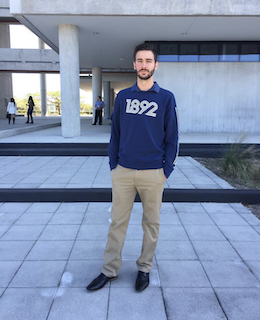

# Background

My name is **Richard Orfao**, I am currently an international student at **Florida International University** Modesto A. Maidique Campus.
I am an international student from Venezuela. I arrived 2 years and a half ago and started studying English at FIU at the English language Institute. Then I transferred to Miami Dade College after 2 semesters to complete my Associate in Arts. Now that I have my A.A. and I am studying at FIU pursuing a bachelors in IT. I am looking for a job since I want to get experience in my field and I will be extremely helpful for me in the future.

### A Picture of Myself

### [Other Projects](http://ocelot.aul.fiu.edu/~rorfa001/)

### Education

**High School Diploma**. June 2014 at Colegio Bolivar y Garibaldi, Caracas, Venezuela.

**Bachelor of Science degree in Information Technology**. September 2014 to December 2015 at Universidad Metropolitana, Caracas, Venezuela.

**A.A. Pathway to a Major in Computer Information System**. May 2018 at Miami Dade College.

**Bachelor of Science degree in Information Technology**. Expected May 2019 at Florida International University.

**Cumulative GPA:** 3.5 / 4.0.

Member of **Golden Key Honor Society** since October 2018

### RELEVANT COURSEWORK

*   **Programming Languages:** C++, Java, Linux Shell, Windows Batch, HTML, CSS, PHP, JavaScript, MySQL.
*   **Design programs:** AutoCAD.
*   **Classes:** Operating Systems, Applied Networking, and Database Administration.

### Skills

- **Languages:**
  - Spanish
  - English 
  - Italian
  - Portuguese
- **Competences:** 
  - Initiative and problem-solving abilities
  - Prioritizing
  - Organization
  - Multitasking
  - Communication
  - Adaptability
  - Collaboration
  - Energetic work attitude.

-  **Operating Systems:** 
  - Windows
  - Linux
  - Mac OS.
